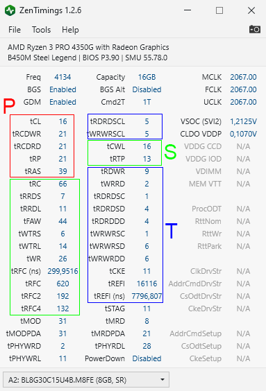

# AMD-RAM-OC-Guide

* Units:
  * Hertz: It is a unit of frequency used in the SI, it is equivalent to one cycle per second.
  * Transfer: It refers to a quantity of data that can be transferred in a second regardless of frequency. 

* Prefixes:
  * Nano (n): 10-9
  * Mega (M): 106
  * Giga (G): 109
  

# Basics:
  This section will go through the minimum knowledge required to overclock RAM. 

* RAM frequency is measured in megahertz (MHz), having your RAM operating at a higher frequency means more cycles per second, which will give you some extra performance. Having very high frequencies can make your RAM unstable and it may crash your PC.
  * **Advanced tip:** The only case witch lowering the clock will result in better performance is in tREFI, since tREFI measures the timing between RAM refreshes. While your RAM refreshes, you can't write or read anything on it, so you want to make that time gap as little as possible.

* RAM Timings are the latency between various operations inside a RAM chip, having low latencies will result in better performance, so keep them as low as possible. Having very low timings will also make your RAM unstable and may result in crashes. 
  * The main timing of your ram is called CL, tCL or CAS Latency, it measures the delay between the **READ** command and the moment the data is available, this interval is specified in nanoseconds.
  
* When you buy a RAM stick, sellers usually show their transfer rate and their tCL. For example, "DDR4-3000 CL15" (3000 MT/s and tCL of 15ns) and "DDR4-3600 CL18" (3600 MT and tCL of 18ns).

* Common mistakes:

  * People usually refer to DDR4-3000 as 3000 **MHz**, but they are only 1500 **MHz**, this happens because we use DDR RAM, DDR stands for Double Data Rate, which transfers data in the rising edge of the clock and the falling edge of the clock, so the real frequency of the RAM is half the number of transfers it makes in a second. So a DDR4-3000 operates in 1500 **MHz (Megahertz)** and will transfer 3000 **MT/s (MegaTransfers per second)** of data.

  * "DDR4-3000 CL15", has a lower tCL, but "DDR4-3600 CL18" has a higher frequency, so it's necessary to evaluate how they compare.
  
  To calculate the true latency measured in nanoseconds (ns) of a given RAM's transfer rate and tCL, just use the formula: `2000 * timing / frequency`
  * DDR4-3000 CL15 = `2000 * 15 / 3000 = 10 ns`.
  * DDR4-3600 CL18 = `2000 * 18 / 3600 = 10 ns`.
  * Through this calculation it's demonstrated that they have the same RAM latency, and thus, the same performance.
  
## Primary, Secondary and Tertiary Timings:
    
* RAM timings are split into 3 categories, primary, secondary and tertiary
* Primary and secondary timings will affect latency and bandwidth, while tertiary timings affect only bandwidth

Red (P) = Primary Timings.

Green (S) = Secondary Timings.

Blue (T) = Tertiary Timings.

# Limiting Factors:  
  This section will go through components that will limit your overclocking capacities. 
 ## Motherboard
  * Always prefer motherboards with 2 DIMM slots, they will let you achieve higher frequencies. However, entry-level motherboard, which usually feature 2 DIMM Slots may not overclock as well thanks to their low-quality PCBs.
    * While using motherboards that use daisy chain (4 slots, usually), 2 sticks are preferred, if you use 4 sticks the performance will be impacted // ver o video do buildzoid
    * Motherboards with T-topology will overclock better with 4 sticks equipped, using 2 sticks will not cap your overclocking capability that much as in a daisy chain with 4 slots. 
 
 ## Integrated Memory Controller (IMC)
   Terminology:
   
  * GDM: Geardown mode, it will round your tCL if it's odd.
    * If you run DDR-3000 CL15 with GDM enabled, the tCL will be rounded to 16.
    * In terms of performance: GDM disabled > GDM enabled.
   
  * MCLK: Memory clock, for example, DDR4-3000, the MCLK is 1500MHz.

  * FCLK: Infinity Fabric clock.

  * UCLK: Unified memory controller clock. 

    * If FCLK and MCLK are synchronized (1:1), `UCLK = MCLK`

    * If FCLK and MCLK are desynchronized (2:1), `UCLK = 1/2 * MCLK`.   
 
 * SOC voltage, is the voltage of the IMC. 
    * It's not recommended to leave it on auto, the range should be around 1.00V and 1.125V. Higher values can also be acceptable and may be necessary for stabilizing memories with higher capacities and stabilizing FCLK. 
    * If your SOC voltage is too high (1.15V-1.25V), it can also cause memory instability.  
 * **(Zen2 only)** VDDG: Infinity Fabric voltage.
   * Needs to be at least 40mV under SOC voltage since it's derived from SOC voltage.  
  
 Expected memory frequency range for 2 single-rank DIMMs, with no motherboard or IC's bottleneck
 
 
  | Ryzen | Expected Speed (MT/s) |
  | :---: | :----------------------: |
  | Zen | 3000 - 3600 |
  | Zen+ | 3400 - 3800 |
  | Zen2 | 3600 - 3800 (1:1 MCLK:FCLK)   3800+ (2:1 MCLK:FCLK) |
  
  With more DIMMs and/or dual-rank DIMMs, the expected frequency may be lower.
  
  * tRCD is split into tRCDRD (read) and tRCDWR (write). Most of the time the tRCDWR can go lower than tRCDRD, but I have not seen any performance gains from it.

 
 # Integrated Circuits (ICs)

 Note: ICs usually are referred to as "dies"
 
  * Knowing well your ICs will give you an idea of what to expect from your RAM.
  * They are a wide variety of ICs which are made by Hynix, Micron, Nanya or Samsung which will perform different while overclocking.
    * Samsung B-die: The best ICs in the market, they will scale very well with voltage and will be able to achieve high clock speeds with tight timings
   
   
  | IC | Expected Max Speed (MT/s) | Daily Voltage (V) | 
  | :-------------------: | :----: | :----: |
  | Samsung B-die | 5000+ | 1.5V | 
  | Hynix D-die (DJR) | 5000+ | 1.5V |
  | Micron E-die | 5000+ | 1.45V |
  | Samsung E-die | 5000+ | 1.45V | 
  | Hynix C-die (CJR) | 4133 | 1.45V |
  | Samsung D-die | 4000+ | 1.45V |
  | Hynix A-die (AFR) | 3600 | 1.45V |
  
  
  ## Density
  
  * x8 configurations are faster than x16.
    * Since they have double the amount of banks and groups compared to x16 configurations. // ver o video do buildzoid e melhorar aqui 
     
  * Densities will determine how far your IC can go while overclocking.
    * Even having the same name, they can have different overclocking results thanks to their differences in density.
      * Micron Rev. B has 8Gb and 16Gb configurations, and the 16Gb version performs better.
        * This happens because having twice as many banks means that twice as many memory rows can be opened or closed at any time. That will save you time on RAS/RC/RCD (waiting for a closed row to open) or RP (waiting for a row to close to open another one) operations because they will be less often.
    
  ## Logical Ranks
  
  * Single-rank sticks are used to clock higher than dual-rank sticks, but dual-rank sticks have the advantage of being able of using rank interleaving.
  
  Rank interleaving allows the memory controller to parallelize memory requests, for example, you can write in one rank while reading or refreshing the other one.  
  
  * Today on Zen3 platforms, newer BIOS and memory controllers support dual-rank better. So you may be able to make dual-rank sticks clock as high as single-rank, but you will also have the performance gains from rank interleaving.
  * The downsides of dual-rank sticks are:
    * In older platforms, BIOS and memory controllers won't support rank interleaving very well.
    * As the total count of ranks in the system increases, the load of the memory controller will also increase, which will require a higher SOC voltage.   
    
  ## Voltage
  
  * On the majority of the ICs, tCL scales with voltage, which means that giving more voltage to the IC, will allow you to drop tCL, but tRCD, tRP and tRFC typically will not scale with voltage.
  * Some bad ICs can also scale negatively with voltage, becoming unstable at higher voltages.
  * Very high voltages can also overheat the ICs and make them perform worse.
  
    
